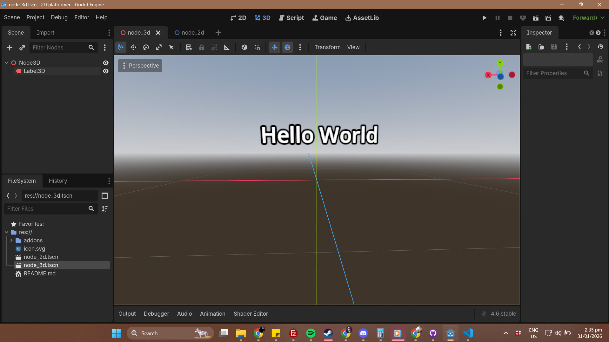

# Game Dev Projects

# Week 1: Activity 1 (hello world)
1. Hello world Project 3D

# Week 2: Actiity 1 (Player movement)
1. Gameplay Mechanics
Handling input (keyboard/gamepad)
physics bodies (rigid/kinematic)
collision detection
Basics of player controllers (movement, jumping).

# Exercises
Build a dodge mechanic or simple platformer character
test with physics tweaks.

https://youtu.be/OjkJL5IQ_FA

