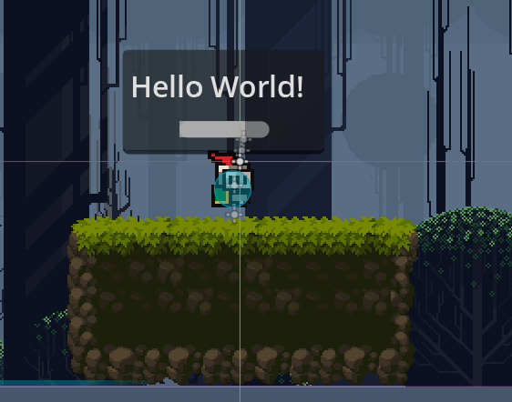
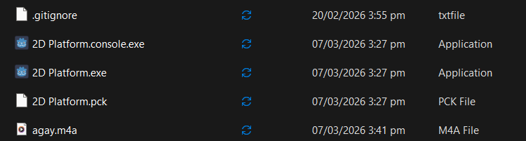

# 🎮 Game Development Activity Log

A structured repository tracking the progress, subtopics, and exercises for my game development journey.

---
## 📅 Week 1: Hello World!

## 📅 Week 2: Gameplay Mechanics

Focusing on the core "feel" of the game through movement and physics.

### 🔍 Subtopics

* **Input Handling:** Mapping and processing keyboard and gamepad inputs.
* **Physics Bodies:** Understanding the difference between `RigidBody` and `KinematicBody`.
* **Collision Detection:** Setting up hitboxes and environment interactions.
* **Player Controllers:** Implementing the fundamentals of movement and jumping.

### 🛠️ Exercises

* **Character Build:** Created a simple platformer character or dodge mechanic.
* **Physics Tuning:** Tested and tweaked gravity, friction, and acceleration values for better "game feel."

### 📺 Resources

* [Watch: Gameplay Mechanics Tutorial](https://youtu.be/OjkJL5IQ_FA)

---

## 📅 Week 3: AI & Interface Design

Expanding the world with intelligent entities and a functional User Interface.

### 🤖 Activity 1: Enemy AI & Pathfinding

* **Subtopics:**
* **Navigation:** Implementing pathfinding for smooth movement.
* **State Machines:** Using Finite State Machines (FSM) for behaviors like Patrolling and Attacking.
* **AI Patterns:** Designing predictable yet challenging enemy movements.

* **Exercise:** Added intelligent enemies to the game world (focused on reactive entities rather than static obstacles).

### 🖥️ Activity 2: UI, UX & Audio

* **Subtopics:**
* **HUD Elements:** Designing health bars, score counters, and status icons.
* **Menu Systems:** Utilizing `CanvasLayer` for clean, responsive menus.
* **Audio Engineering:** Using Audio Buses to mix SFX and background music.

* **Exercise:** * Integrated a full UI overlay into the game prototype.
* Added SFX for actions (Walk, Run, Slash).
* Implemented background music and a game introduction screen.

### 📺 Resources

* [Watch: AI and UI Implementation](https://youtu.be/0uvato0BhE4)

---
## 📅 Week 4: Export

